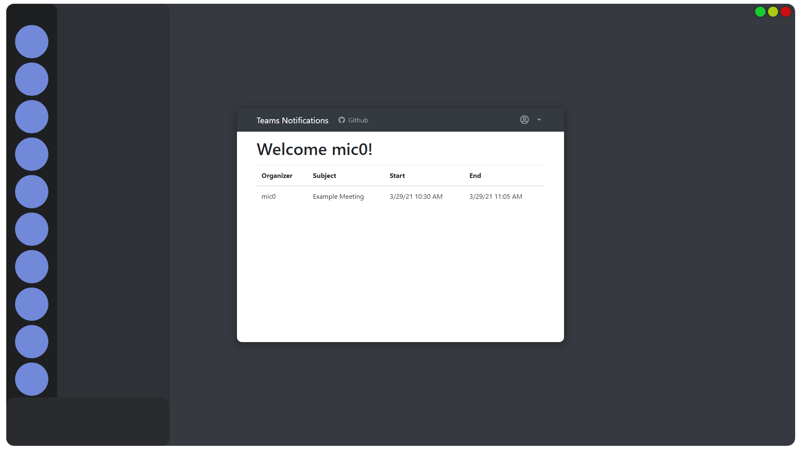
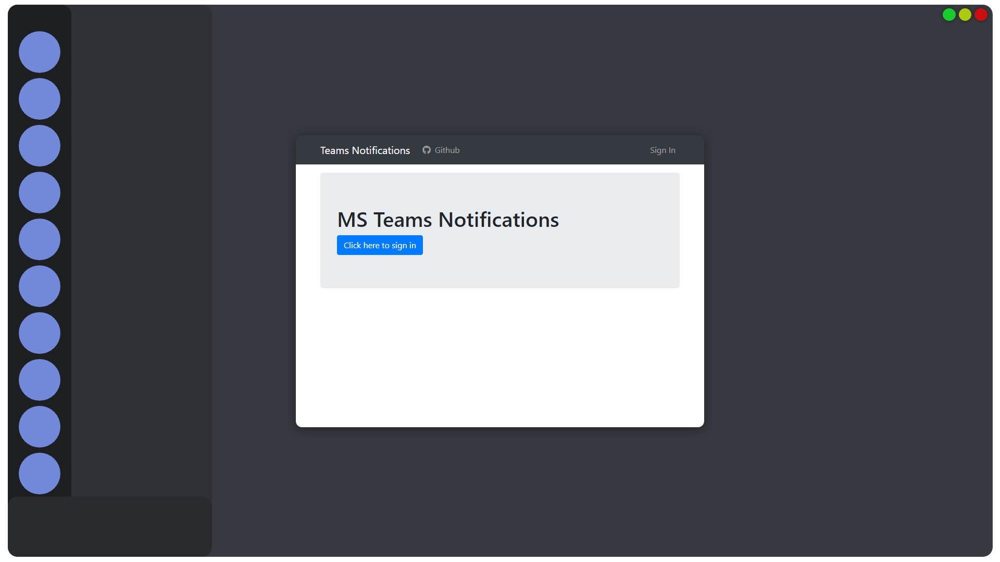

# Teams Notifications

</img> 
</img> 
</img>

### Installation

Before installation, make sure your Node.js version is 14 or higher (use `node -v`)

1. Clone this repo
2. Rename `example.env` to `.env`
3. Create Application: https://docs.microsoft.com/en-us/azure/active-directory/develop/quickstart-register-app
4. Fill `.env` file with credentials gained in step 3
   - Paste Application ID into `OAUTH_APP_ID`
   - Paste Secret into `OAUTH_APP_SECRET`
5. Run `npm start`

### Contributing

Pull requests are welcome. For major changes, please open an issue first to discuss what you would like to change.

### Projects Used

[Microsoft's Graph API Express Example](https://github.com/microsoftgraph/msgraph-training-nodeexpressapp) - I used it because API docs are awful and I couldn't understand it. <!-- Secret Info: Also: Their NPM packages are even worse (or I'm dumb) -->
